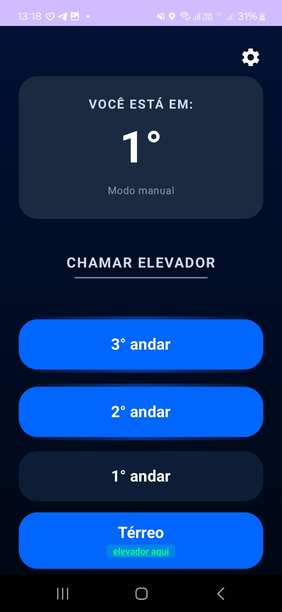
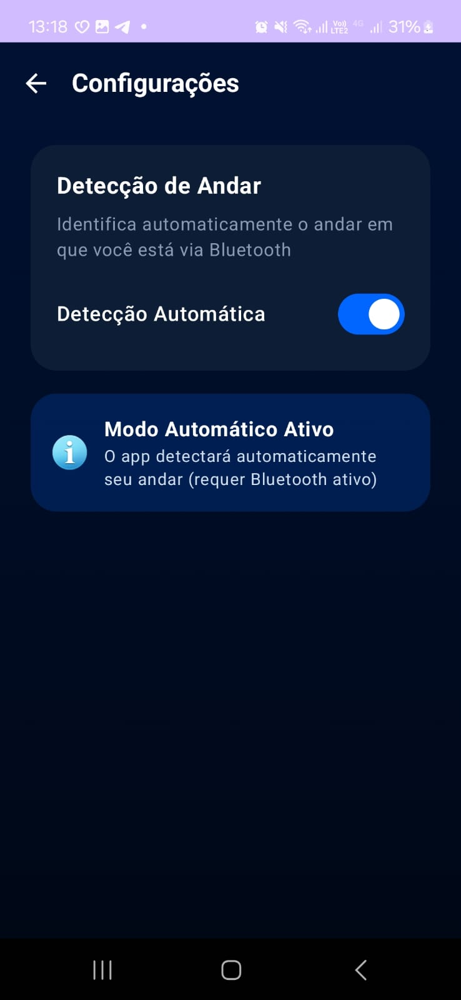
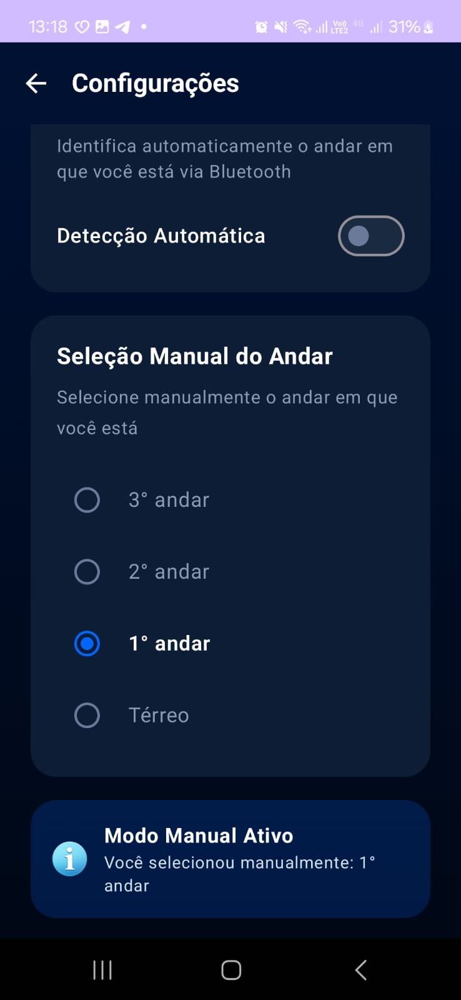

# 🏢 Elevox - Sistema de Controle de Elevador

Sistema IoT para controle de elevadores usando ESP32 e aplicativo Android com comunicação segura HTTPS.

[](https://www.espressif.com/)
[](https://developer.android.com/)

---

## 🌐 [WebSite](https://elevox.vercel.app/)

## 🎯 Visão Geral

O **Elevox** é um sistema de controle de elevadores que permite:

- 📱 **Controle via App Android** - Interface moderna em Jetpack Compose
- 🔐 **Comunicação Segura** - HTTPS com certificate pinning
- 🌐 **Rede Local** - Comunicação WiFi entre app e ESP32
- ⚡ **Tempo Real** - Comandos instantâneos via HTTPS
- 🛠️ **IoT Moderno** - ESP32 como servidor HTTPS
- 🎤 **Controle por Voz** - Integração com Amazon Alexa (via Firebase)

---

## 🏗️ Arquitetura

```
┌─────────────────┐                    ┌─────────────────┐
│                 │                    │                 │
│  App Android    │  HTTPS (TLS 1.2+) │   ESP32 Server  │
│  (Kotlin)       │◄──────────────────►│   (Arduino)     │
│                 │  Certificate Pin   │                 │
│  - Jetpack      │                    │  - WiFi AP      │
│    Compose      │                    │  - LittleFS     │
│  - Retrofit     │                    │  - HTTPSServer  │
│  - OkHttp       │                    │  - mbedtls      │
│                 │                    │                 │
└─────────────────┘                    └────────┬────────┘
                                                │
                                                │ Serial
                                                ▼
                                       ┌─────────────────┐
                                       │                 │
                                       │  Arduino Mega   │
                                       │  (Controle)     │
                                       │                 │
                                       └─────────────────┘
```
### 📁 Pastas
Pasta > elevox-alexa-skill
Arquivos da programação da integração com alexa

Pasta > elevox-app
Arquivos da programação do aplicativo mobile

Pasta > elevox-server
Arquivos da programação do servidor https do ESP32, voltado para comunicação sem fio

---

## 🤖 Aplicativo

Visual inicial do app:



Página de configurações no modo automático:



Página de configurações no modo manual:



Totalmente responsivo e funcional com o talkback!

## 🔒 Segurança

O projeto implementa múltiplas camadas de segurança:

### ✅ Implementado

- **HTTPS (TLS 1.2+)** - Toda comunicação criptografada
- **Certificate Pinning** - SPKI SHA-256 no app
- **Hostname Verification** - Validação do hostname do servidor
- **Timeouts Agressivos** - 5s connect, 10s read

### 📖 Documentação

**⚠️ IMPORTANTE:** Este projeto usa certificados auto-assinados adequados para **desenvolvimento**. Para produção, use certificados válidos.

---

## 🎤 Integração Alexa

O Elevox pode ser controlado por voz usando a Amazon Alexa através do Firebase Realtime Database!

### Arquitetura

```
Alexa → AWS Lambda → Firebase → App Android → ESP32
```

### Comandos de Voz

- **"Alexa, abre Elevox"** - Inicia a skill
- **"Alexa, pede Elevox para chamar o elevador"** - Chama elevador
- **"Alexa, pede Elevox para ir para o andar cinco"** - Vai para andar específico

---

## 📦 Pré-requisitos

### Para o App Android

- **Android Studio** Arctic Fox ou superior
- **JDK** 11 ou superior
- **Android SDK** 24+ (Android 7.0+)
- **Gradle** 8.0+

### Para o ESP32

- **Arduino IDE** 2.0+ ou **PlatformIO**
- **ESP32 Board** (testado com ESP32 Bluetooth 38 Pinos CP2102)
- **Biblioteca HTTPSServer** ([esp32_https_server](https://github.com/fhessel/esp32_https_server))
- **Arduino Mega** (opcional, para controle do elevador)

### Ferramentas Auxiliares

- **Python 3.7+** (para scripts utilitários)
- **OpenSSL** (para geração de certificados)

---

## 💡 Uso

### Testando a Conexão

1. **Certifique-se** de que o ESP32 está conectado ao WiFi
2. **Abra o app** no dispositivo Android
3. **Conecte** o dispositivo à mesma rede WiFi do ESP32
4. **Toque** em "Testar Conexão"
5. **Aguarde** a confirmação de sucesso

### Monitor Serial (ESP32)

O ESP32 oferece comandos via Monitor Serial (115200 baud):

```
help         - Mostra comandos disponíveis
list         - Lista arquivos no LittleFS
check        - Verifica certificados
cat <file>   - Mostra conteúdo de arquivo
format       - Formata o LittleFS (requer confirmação)
```

### Logs do App

Para ver logs detalhados no Android:

```bash
adb logcat -s HTTPS:* ApiClient:*
```

---

## 🛠️ Scripts

Os scripts na pasta `scripts/` auxiliam na configuração:

| Script | Descrição |
|--------|-----------|
| `gerar_cert_esp32.py` | Gera certificados SSL para ESP32 |
| `copiar_cert_para_app.py` | Copia certificado para o app |
| `fix_certificates.py` | Corrige problemas de formato |

Ver [scripts/README.md](scripts/README.md) para documentação completa.

---

